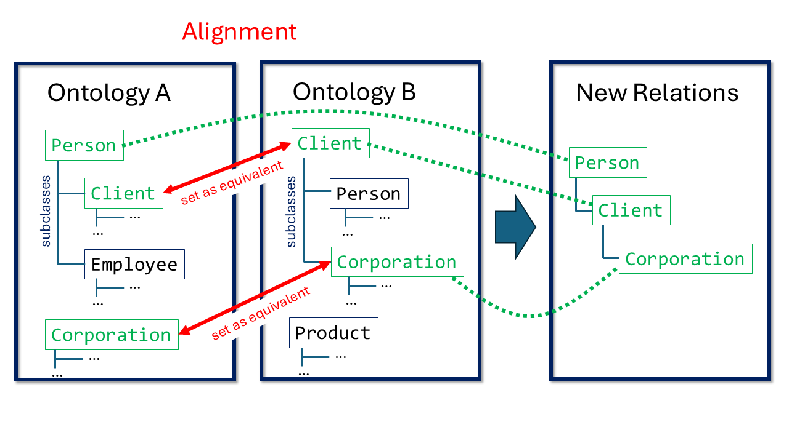

Ontology matching, i.e., identifying that two independently built knowledge graphs describe the same or related things under different names, is a decades-old, still only partly solved problem. This project tests whether an agentic LLM can tackle this task, by extending GRASP to ontology matching and comparing it against recent official OAEI Conference-track participants. A general-purpose LLM agent, with no ontology-matching-specific setup at all, already matches the performance of this year's specialized top matchers, while GRASP's own knowledge-graph tools do not yet improve on that for small ontologies.

<!--more-->

## Disclaimer

I used Claude (Anthropic) as a writing assistant for this blog post: formatting citations, translating this post from German to English, and drafting suggestions for phrasing, the introduction, and the summary, all of which I reviewed, edited, and approved myself. All technical content, results, and analysis are my own.

---

## Introduction
Imagine merging two conference-management systems: one calls a submitted paper a `Paper`, tracks its `Reviewers` and their `Reviews`; the other uses `Document`, `TPCMember`, and `Feedback` for exactly the same things. Before the merged system can work correctly, someone — or something — has to figure out that these differently named concepts actually mean the same thing. This is the task of ontology matching, and despite three decades of research there is still plenty of room for improvement.

At the same time, large language models (LLMs) equipped with the ability to explore and query knowledge graphs have started to appear in OM as well, though so far mostly as a helper bolted onto traditional matching pipelines rather than as the core matching engine itself.

This project asks what happens if that division of labor is reversed: can GRASP, a framework built for letting an LLM agent explore and reason over knowledge graphs, be extended to drive ontology matching itself? The following sections give a short primer on ontology matching and how LLMs have been used for it so far, lay out the project's concrete research questions, describe the GRASP-based prototype built for it, and present its results on the OAEI's Conference track compared against this year's official participants.

## Ontology Matching

*This section is based largely on the standard reference by Euzenat and Shvaiko <a href="#euzenat2013">[1]</a>.*

*Ontology matching* or *ontology alignment* (hereafter OM) has been an active field of research since the 1990s and still plays an important role in the real world today. When two companies merge, for instance, or legacy software systems are consolidated, their databases have to be linked. Without OM, the merged system would not recognize that ```client``` and ```date_of_birth``` in system A mean the same thing as ```customer``` and ```DOB``` in system B, leading to duplicate records, fragmented data, and analyses that report incorrect figures. Customers would receive duplicate invoices, search queries would return incomplete results, and automated workflows would fail on incompatible fields. OM is likewise used extensively in medical and pharmaceutical research, where hospitals and laboratories worldwide need to harmonize clinical trial data and drug databases. It is equally indispensable for modern web search engines and knowledge graphs (such as Wikidata or Google), which connect data globally, as well as for e-commerce platforms and supply chains that merge product data and spare-parts catalogs from thousands of heterogeneous suppliers into a single system in real time.

OM is difficult for computers for several reasons. First, equivalence and other relations between the individual entries in the databases (in technical terms, *entities*) rest on vague semantic-pragmatic (in the linguistic sense) criteria. One example is what Euzenat and Shvaiko call "semiotic heterogeneity" <a href="#euzenat2013">[1, p. 38]</a>. On this, they write <a href="#euzenat2013">[1, p. 38]</a>: 
> "[Semiotic heterogenity] is concerned with how entities are interpreted by people. Indeed, entities which have exactly the same semantic interpretation are often interpreted by humans with regard to the context, for instance, of how they are ultimately used. This kind of heterogeneity is difficult for the computer to detect and even more difficult to solve, because it is out of its reach. The intended use of entities has a great impact on their interpretation, therefore, matching entities which are not meant to be used in the same context is often error-prone."

Besides linguistic-semantic factors, structural factors (i.e., how the knowledge graph is built) also play a major role. This can be illustrated with a simple phenomenon: 

<figure>
  
  <figcaption style="text-align: center;"><p>Figure 1: Lexically high-confidence but structurally unfitting correspondences.</p></figcaption>
</figure>

If the entities ```Corporation``` and ```Client``` in the two ontologies are set as equivalent, a problem arises: in the newly merged ontology, ```Corporation``` becomes a subcategory of ```Person```. A query for persons would then suddenly also return company objects. In the worst case, structural errors in matching can render an alignment completely unusable if they introduce logical violations, particularly when the database is represented in a highly formalized form (e.g., OWL/OWL2) on which reasoning is performed. There are many other structural consistency and similarity criteria that must be considered during matching. Here too, similarity measures remain quite vague, owing to subtle semiotic differences between graph models.

Finally, matching tasks often involve large ontologies (biomedical ontologies, for example, frequently comprise millions of entries), which is why matchers need to scale well.

Because the task is so difficult for machines, ontology alignment remains a challenge to this day. Regarding pure schema matching — the task this project is concerned with — the OAEI, which has for years been the standard evaluation platform for ontology matching, states <a href="#oaei2025">[2, p. 28]</a>: 
> "[S]till little substantial progress [is reached] in terms of the quality of the results or runtime of top matching systems. As already reported in the last years, we observe a performance plateau being reached by existing strategies and algorithms. It is also true that established matching systems tend to focus more on new tracks and datasets than on improving their performance in long-standing tracks, whereas new systems typically struggle to compete with established ones. [...] The best-performing systems are not consistent across tasks and settings, demonstrating the diversity of our datasets."

## Ontology Matching with LLMs
In recent years, LLMs have increasingly been incorporated into OM. Since training or even fine-tuning LLMs for this specific task has proven impractical <a href="#qiang2024">[3, p. 2]</a>, most systems instead use general-purpose LLMs via natural-language prompts. Because LLMs come with a very high runtime-complexity overhead, candidate search and selection in the systems tested so far is typically not left entirely to the LLM, but is complemented by traditional methods. Across every matcher I reviewed that uses LLMs and has taken part in the OAEI in recent years, the LLM's role is limited to two functions: 
1. Validating mappings: the LLM helps to choose, among several pre-selected candidates, which one constitutes a valid mapping. These are typically edge cases that the other matching methods could not clearly confirm or rule out.
2. Enriching node information: the LLM is asked, for example, to augment labels with a short description of their meaning in the context of the graph, so that later steps can apply more robust similarity measures.

In both cases, the LLM always decides in a single, "one-shot" step, based only on limited context such as an entity's direct neighbors, label, and synonyms.
A notable example is AgentOM, which its creators describe, in a paper of theirs, as the "first [...] LLM-agent-based framework for OM tasks" <a href="#qiang2024">[3, p. 519]</a>. A review of the described algorithm and its source code shows that here, too, candidate search for equivalences between entities is largely carried out using traditional, deterministic methods, and that the LLM — besides enriching information about individual entities — functions only as an additional validation instance when equivalences are finally set.

## Project Goals and Research Questions
Since [GRASP](https://grasp.cs.uni-freiburg.de) has proven itself on many knowledge-graph-related tasks, this project set out to extend GRASP for OM. The plan was to first build a small prototype and test it on small pairs of ontologies. The literature review above shows that a genuinely agentic use of an LLM for the OM task has not yet been attempted. 

Accordingly, the project's central questions are:
1. Are agentic LLMs in general a promising approach for OM?
2. To what extent can GRASP help an agentic LLM perform the OM task faster and/or more accurately?

## GRASP in Brief
GRASP works with RAG by equipping a freely chosen LLM with an overview over the knowledge graphs involved as well as elaborate graph search and exploration functions. It further implements an agentic loop in which the LLM receives an input instruction and then works out a solution to the given task over several rounds <a href="#walter-bast2025">[4]</a>. What makes GRASP distinctive is that it helps the agentic LLM master diverse tasks in a zero shot setting — that is, the model receives neither task-specific fine-tuning nor examples in its prompt (few-shot learning), but instead has to solve the task solely from a general instruction and its own exploration of the knowledge graph via the tools GRASP provides. This allows the LLM to find more flexible solutions. Accordingly, a core part of the GRASP philosophy is that the different tasks are kept as open as possible, rather than only solving specific, narrowly defined task types. For this project, that means: different representation formats should be supported, not just OWL ontologies, even though the usual benchmarks mostly rely on the latter. In the same spirit, a GRASP-based ontology matcher should not be limited to one narrow sub-task, such as finding exact 1:1 equivalences between classes and properties (T-Box matching) or simple instance matching (A-Box matching, i.e., linking individual data records rather than schema concepts). It should also be able to recognize weaker relations between concepts beyond plain equivalence — for instance, subsumption ("X is a special case of Y") or the kinds of relations defined by frameworks such as STROMA <a href="#stroma">[7]</a>, e.g., `IsPartOf` or `Related` — and should be able to match not just single, atomic concepts but also composite ones, i.e., concepts built by combining several simpler ones through logical operators such as union or intersection (e.g., "a Person who is both a Reviewer and an Author").

## The Test Track
As a point of reference for the first prototype, the OAEI's "Conference track" was chosen. As mentioned above, the OAEI's tracks are the de facto standard benchmarks for OM. The Conference track in particular was chosen because it involves setting simple 1:1 equivalences between small ontologies (roughly 80–200 entities per ontology). With a few minor and negligible exceptions, these ontologies contain only classes and properties, no instances or literals (so-called "T-Box matching"). In doing so, the OAEI deliberately separates pure schema matching from instance matching ("A-Box"), which is more concerned with attribute similarity, duplicate detection, and scaling to large volumes of data, and instead focuses on the core question of ontology matching: whether two independently created concept hierarchies model the same concepts. This suits a first GRASP prototype well, because it keeps both the search space (80–200 rather than potentially millions of entities) and the number of tool calls needed per run manageable, while the signals that LLMs' strengths rely on, i.e., lexical context in diverse forms, are at the center of the task. 

It is also worth highlighting that, like most other OAEI tracks, all ontologies in this track are represented in the strongly formalized, reasoning-capable OWL format. This may be surprising, since in practice — in company databases, for instance — simpler and not always logically consistent models are far more common. The likely reason is that such logically consistent models are simply easier to evaluate. It also makes it possible to test whether matchers can read and exploit deeper relations between entities, such as disjointness and sub-entity relations. Here, GRASP's strength lies in the fact that it is not restricted to a single format and does not require logical consistency to perform the task well, but can instead respond flexibly to different formats and contexts. In that sense, the strong (artificial) focus on OWL ontologies is, if anything, an additional challenge for measuring GRASP's capabilities.

Overall, the Conference track is therefore a good test baseline for a first prototype that applies an agentic LLM to OM: it consists of small ontologies, requires good NLP — which is where LLMs excel — while at the same time it can expose potential weaknesses, since top-down reasoning and logical consistency are still a challenge for LLMs.


## Implementation
The prototype aimed to stay within the GRASP framework as much as possible, initially forgoing other external modules or task-specific extensions, in order to have a baseline for further development. Accordingly, implementing the OM task within the GRASP framework involved:
1. Formulating a suitable prompt for the LLM.
2. Writing dedicated tools for the LLM to set and remove correspondences.
3. Implementing injectivity enforcement when setting equivalences.
4. Integrating the remaining GRASP components, namely the GRASP tools and `Shapes`, an index that provides a quick overview of a class's graph context for each class (see below in the example agentic loop).


## Example of an LLM Run within an OM Task Using GRASP
Below is an excerpt from an actual run in which the LLM was tasked with aligning entities from the `cmt` ontology against those of the `edas` ontology. The run shows the chat record for aligning one single source entity from `cmt` (out of 88). It took 9 steps in total; the system prompt and steps 3–6 have been cut here for space.
```text
USER

Align the following entity from the source ontology cmt with an entity
from the target ontology edas or verify it has no appropriate match:
### Entity 1
**Source**: Full IRI: http://cmt#Chairman, shortened IRI: cmt:Chairman,
label: Chairman, aliases: ['Chairman'], infos: ['class', 'subclass of Person']

shape:
cmt:Chairman {
  cmt:markConflictOfInterest cmt:Paper ;
}

Shapes are approximate (derived from instance data and/or schema
declarations) and may be incomplete, so treat them as guidance. A
leading ^ marks an inverse edge, where the class is the property's object.


Step 1
MODEL

I’ll compare CMT’s generic conference chair role with EDAS chair
classes, starting from target shape discovery and then verifying
hierarchy and review/conflict context.

search_shape({
  "kg": "edas",
  "query": "chair person conference management",
  "page": 1
}):
Shapes (page 1 of 2):
1. edas:ConferenceChair {
  edas:initiates edas:Call ;
  edas:isReviewing edas:Paper ;
  ^edas:isInitiatedBy edas:Call ;
  ^edas:isReviewedBy edas:Paper ;
}
2. edas:SessionChair {
  edas:initiates edas:Call ;
  edas:isReviewing edas:Paper ;
  ^edas:isInitiatedBy edas:Call ;
  ^edas:isReviewedBy edas:Paper ;
}
3. edas:ConferenceSession {
  edas:hasRelatedDocument edas:Document ;
  ^edas:relatesTo edas:Document ;
}


Step 2
MODEL

`edas:ConferenceChair` is the likely counterpart; I’ll verify that it
is a Person-level chair role and check whether CMT’s `Chairman` has
any narrower session-specific meaning.

execute({
  "kg": "edas",
  "sparql": "SELECT ?super ?disjoint ?p ?range WHERE {
    OPTIONAL { edas:ConferenceChair rdfs:subClassOf ?super .
               FILTER(isIRI(?super)) }
    OPTIONAL { edas:ConferenceChair owl:disjointWith ?disjoint }
    OPTIONAL { edas:ConferenceChair ?p ?range .
               FILTER(?p IN (rdfs:subClassOf, rdfs:label, rdfs:comment)) }
  }"
}):
Got 1 row and 4 columns in 0.03s:
| super                | disjoint             | p               | range                |
| -------------------- | -------------------- | --------------- | -------------------- |
| Person (edas:Person) | Author (edas:Author) | rdfs:subClassOf | Person (edas:Person) |


[...]


Step 7
MODEL

EDAS has no generic `Chairman`; `ConferenceChair` and `SessionChair`
are distinct. CMT’s generic management role aligns with the
conference-level chair rather than the programme-session role, so I
will establish the high-confidence correspondence.

set_correspondence({
  "source_entity": "http://cmt#Chairman",
  "target_entity": "http://edas#ConferenceChair",
  "overwrite": false
}):

Mapping Conflict detected: The entity 'http://edas#ConferenceChair'
has already been mapped to 'cmt:ConferenceChair', but you proposed a
new mapping to 'http://cmt#Chairman'.

Do not default to keeping the existing mapping. 
Treat both candidates as hypotheses and evaluate them from scratch:
- Option A (Current):   'http://edas#ConferenceChair' ≡ 'cmt:ConferenceChair'
- Option B (New candidate): 'http://edas#ConferenceChair' ≡ 'http://cmt#Chairman'

Compare both semantically and structurally. 
Which target entity is genuinely the better conceptual match?
- If Option B is superior: Re-submit by calling 
    `set_correspondence(..., overwrite=True)`.
- If Option A is superior: It will be automatically retained. 
    Find a different valid match for the unmapped entity or leave it unmapped.


Step 8
MODEL

A collision shows that `edas:ConferenceChair` is already aligned to
CMT’s explicitly named `ConferenceChair`. I’ll compare the two CMT
chair concepts directly; the exact conference-role name is likely the
superior match, while `Chairman` may have no safe EDAS equivalent.

execute({
  "kg": "cmt",
  "sparql": "SELECT ?class ?super ?p ?range WHERE {
    VALUES ?class { cmt:Chairman cmt:ConferenceChair }
    OPTIONAL { ?class rdfs:subClassOf ?super . FILTER(isIRI(?super)) }
    OPTIONAL { ?class ?p ?range .
               FILTER(?p NOT IN (rdf:type,rdfs:subClassOf,owl:equivalentClass)) }
  } ORDER BY ?class ?p"
}):
Got 2 rows and 4 columns in 0.02s:
| class                                  | super                                    | p                | range                                  |
| -------------------------------------- | ---------------------------------------- | ---------------- | -------------------------------------- |
| Chairman (cmt:Chairman)                | Person (cmt:Person)                      |                  |                                        |
| Conference Chair (cmt:ConferenceChair) | Conference Member (cmt:ConferenceMember) | owl:disjointWith | Associated Chair (cmt:AssociatedChair) |


Step 9
MODEL

No correspondence set for `cmt:Chairman`.

`edas:ConferenceChair` is already and more precisely aligned with
`cmt:ConferenceChair`. `cmt:Chairman` is only a generic `Person`
subclass, while EDAS offers only conference- and session-specific
chair roles; neither is safely equivalent.

OUTPUT
| Source Entity (Ontology 1)        |  Target Entity (Ontology 2) | Relation |
| --------------------------------- | --------------------------- | -------- |
| http://cmt#Conference             |      http://edas#Conference |        = |
| http://cmt#Paper                  |           http://edas#Paper |        = |
| http://cmt#Person                 |          http://edas#Person |        = |
| http://cmt#Reviewer               |        http://edas#Reviewer |        = |
| http://cmt#Document               |        http://edas#Document |        = |
| http://cmt#ProgramCommitteeMember |       http://edas#TPCMember |        = |
| http://cmt#Author                 |          http://edas#Author |        = |
| http://cmt#Review                 |          http://edas#Review |        = |
| http://cmt#ConferenceChair        | http://edas#ConferenceChair |        = |

================================================================================

TRACE (task=om, elapsed=19.19s)
```


## Tests
To evaluate matchers, the OAEI implements the [MELT](https://dwslab.github.io/melt/) framework. All tests described below were evaluated using this evaluation environment, in order to compare results with current state-of-the-art matchers that have taken part in the OAEI in recent years. The full evaluation comprises 7 ontologies to be aligned pairwise (out of 16 ontologies in the track in total), yielding 21 test pairs. I carried out the following tests:

1. First, a full test run over the 21 ontology pairs from the Conference track was carried out natively with Claude Code in the Claude Code CLI, i.e., completely without GRASP. Here, only the same prompt used for the OM task in GRASP was used. The goal was to get an initial sample of how a high performance middle-tier model performs in an agentic environment that allows an LLM to work on tasks over multiple steps.

2. Second, several test runs were carried out on a sub-sample of 4 ontologies, and thus 6 ontology pairs instead of 21, since tests are costly due to the use of an LLM via API. Here, my GRASP extension was tested with OpenAI's GPT-5.6 Terra. First, the task was organized — following the pattern of other GRASP tasks — so that the LLM had to map only a single entity from the source ontology to the target ontology per run. A matching task therefore consisted of many runs, e.g., 100 individual runs when the source ontology had 100 entities. For comparison, a test was run with OpenAI's GPT-5.6 Terra without GRASP, similar to the test with Claude Code, to see whether differences emerge when working on the task within the GRASP framework. All model configurations (verbosity, reasoning effort, etc.) were kept identical to the GRASP test run. Based on the results of these two tests, a further test run was then carried out on the same 6 ontology pairs with GRASP, but this time without matching individual entities per run; instead, the entire source ontology was provided at once. This meant that, within a single run, the LLM had to find equivalent counterparts in the target ontology for up to 185 entities.

## Test Results
MELT evaluates Conference-track alignments against a reference alignment manually crafted by experts. For its internal evaluation, the OAEI uses two further stages, which are not publicly accessible and therefore cannot be reproduced exactly. Although the third stage is, according to the OAEI, the decisive one ("uncertain" reference alignment, resolved for logic violations) <a href="#oaei2025eval">[5]</a>, a review of the results shows that the ranking of matchers stays the same between the first stage described here and the third. The main difference is that matchers generally perform worse when measured against the third reference alignment. All results shown here therefore use the crisp reference-alignment version, i.e., the first stage described above ("ra1-M3" according to <a href="#oaei2025eval">[5]</a>):

<figure>
  
  <figcaption style="text-align: center;"><p>Figure 2: Official results for the Conference track 2025 (ra1-M3), according to <a href="#oaei2025eval">[5]</a>.</p></figcaption>
</figure>

<figure>
  
  <figcaption style="text-align: center;"><p>Figure 3: Results from my tests, compared to the official OAEI results 2025.</p></figcaption>
</figure>

## Analysis and Disscussion of the Results
Figure 3 shows that the results of agentic LLMs are promising for small ontologies such as those in the OAEI's Conference track. A general-purpose LLM agent like Claude Code, run with default configurations in its native environment that was not specifically set up for this task (the Claude Code CLI), achieves a result whose F1 score is slightly better than that of the specialized top matchers of 2025.

It is also noticeable that, unlike current matchers, the results of agentic LLMs shift strongly toward the "recall" half of the diagram. This aligns with earlier studies reporting a similar tendency for LLMs to achieve high recall at the expense of precision in OM <a href="#he2023">[6]</a>. Notably, these results emerged even though the prompt given to the LLM in the current project was deliberately framed strictly in every test case, with several embedded "precision over recall" hints and explanations of how the LLM should avoid overly generous equivalence settings, since I was already aware of this problem from the literature and from preliminary tests.

A second notable point is that the results from the plain GPT-5.6 Terra run without GRASP are similarly strong as the test runs with GRASP. In this minimal control run, the LLM could only use standard bash tools — it could not make network calls and, unlike the test run in the GRASP environment, had no way to issue SPARQL queries against the ontologies. An analysis of the conversation log shows that in this setting the LLM worked mainly through the Python library `RDFLib`, which let it retrieve relevant information about the overall ontology and individual entities. By contrast, the same LLM with the same settings in the GRASP context relies heavily on SPARQL calls alongside GRASP's own search functions. The similar F1 results between GPT-5.6 with and without GRASP came as a great surprise to me and the GRASP team, since working on other tasks with GRASP — Cell Entity Annotation, in particular — has shown that the LLM needs this kind of breakdown into individual elements to perform well. For OM with small ontologies, however, the tests show that such fine-grained batching is a misconfiguration. One possible explanation is that evaluating equivalence between two clearly labeled, atomic entities (as opposed to a composite concept built from several entities via conjunction or disjunction) is a comparatively simple task for an LLM: it appears to rely mostly on word relatedness learned from training data — that is, on associative, lexical proximity between concepts — rather than on strict logical inference. This matches findings from a controlled ontology-learning experiment, where LLMs performed substantially worse at relation extraction and taxonomy discovery once the familiar English terms in the ontology were swapped out for gibberish terms with the same underlying structure, suggesting that the models lean on lexical familiarity rather than on reasoning over the relationships themselves <a href="#mai2024">[8]</a>. Viewed this way, exhaustive graph exploration may not add much, because the information the LLM actually needs is already contained in the labels of the entities and their direct neighbors, so each individual equivalence decision remains a comparatively simple task. 

While the F1 scores with and without batching are similar, there are large differences in runtime and token consumption: the LLM without GRASP needed just under 650,000 tokens for all 6 ontology pairs, whereas the unbatched GRASP run consumed more than 3.5 million tokens for the same task, and the batched GRASP run (one entity per run) needed even more — over 22 million tokens. A closer look at the conversation log shows that most of this overhead comes from GRASP's internal run design rather than from an inherent need for exhaustive exploration: every tool call forces a new round, and on every round the LLM is sent the entire chat history again — in the unbatched run, that means the full conversation history was resent for every one of the 99 correspondences set. To test this, I reran the unbatched setting with `parallel_tool_calls` enabled, letting the LLM issue several tool calls per round instead of just one. This cut token consumption to about 1 million tokens for all 6 pairs — still higher than the 650,000 tokens used without GRASP, but far closer than the 3.5 million consumed without parallel tool calls — without a noticeable drop in alignment quality. The one-tool-call-per-round rule was originally kept so that every equivalence setting could be checked for injectivity violations, but this result suggests it is not strictly necessary and should be reexamined in the future. The remaining overhead in the single-entity-per-run (batched) setup comes from the LLM re-exploring the source and target graphs from scratch for every source entity (more than 3,000 SPARQL, search-function, and graph-verbalization calls spread across the whole task, versus 55 such calls in the unbatched GRASP run) — a cost that apparently offers no real benefit for this task.

## Conclusion and Outlook
This project focused on a first prototype for OM using GRASP. At its center was a 'purist' GRASP artifact that tries to solve this task as much as possible with GRASP's own means, following the pattern of other GRASP task implementations (Cell Entity Annotation, in particular). A literature review and survey of the matchers that have taken part in the OAEI in recent years shows that a matcher based on an agentic LLM has so far been a gap in the field. Furthermore, the tests carried out in this project show that general-purpose, everyday LLM agents already achieve considerable results in OM. At the same time, however, it also becomes clear that, for small ontologies, GRASP does not yet offer any added value over simple, general-purpose environments for agentic LLMs.

Central questions that result from the project are:
1. Can the results for small ontologies still be improved significantly?
2. How can such OM-LLM agents be scaled to large ontologies?

GRASP has the potential to help with both problems. To this end, prompts for the LLM should be developed and refined more systematically, and possible setups for combining it with traditional methods should be investigated.


<footer>
    <h1 id="references"> References </h1>
    <ol id="references-ol">
        <li id="euzenat2013"> J. Euzenat and P. Shvaiko, <em>Ontology Matching</em>, 2nd ed. Berlin, Heidelberg: Springer, 2013. doi: <a href="https://doi.org/10.1007/978-3-642-38721-0">10.1007/978-3-642-38721-0</a>. </li>
        <li id="oaei2025"> M. Abd Nikooie Pour et al., "Results of the Ontology Alignment Evaluation Initiative 2025," CEUR Workshop Proceedings, vol. 4144, 2025. <a href="https://inria.hal.science/hal-05447839v1/document">https://inria.hal.science/hal-05447839v1/document</a>. </li>
        <li id="qiang2024"> Z. Qiang, W. Wang, and K. Taylor, "Agent-OM: Leveraging LLM Agents for Ontology Matching," Proceedings of the VLDB Endowment, vol. 18, no. 3, pp. 516–529, 2024. doi: <a href="https://doi.org/10.14778/3712221.3712222">10.14778/3712221.3712222</a>. </li>
        <li id="walter-bast2025"> S. Walter and H. Bast, "GRASP: Generic Reasoning And SPARQL Generation across Knowledge Graphs," in <em>The Semantic Web – ISWC 2025</em>, Lecture Notes in Computer Science, Springer, 2026. doi: <a href="https://doi.org/10.1007/978-3-032-09527-5_15">10.1007/978-3-032-09527-5_15</a>. </li>
        <li id="oaei2025eval"> Ontology Alignment Evaluation Initiative (OAEI), "Conference Track 2025 – Evaluation." oaei.ontologymatching.org, 2025. [Online]. Available: <a href="https://oaei.ontologymatching.org/2025/results/conference/eval.html">https://oaei.ontologymatching.org/2025/results/conference/eval.html</a>. [Accessed: Sep. 8, 2026]. </li>
        <li id="he2023"> Y. He, J. Chen, H. Dong, and I. Horrocks, "Exploring Large Language Models for Ontology Alignment," CEUR Workshop Proceedings, vol. 3632, 2023. <a href="https://ceur-ws.org/Vol-3632/ISWC2023_paper_427.pdf">https://ceur-ws.org/Vol-3632/ISWC2023_paper_427.pdf</a>. </li>
        <li id="stroma"> P. Arnold and E. Rahm, "Enriching ontology mappings with semantic relations," <em>Data &amp; Knowledge Engineering</em>, vol. 93, pp. 1–18, 2014. doi: <a href="https://doi.org/10.1016/j.datak.2014.07.001">10.1016/j.datak.2014.07.001</a>. </li>
        <li id="mai2024"> H. T. Mai, C. X. Chu, and H. Paulheim, "Do LLMs Really Adapt to Domains? An Ontology Learning Perspective," in <em>The Semantic Web – ISWC 2024</em>, Lecture Notes in Computer Science, vol. 15231, Springer, Cham, 2025, pp. 126–143. doi: <a href="https://doi.org/10.1007/978-3-031-77844-5_7">10.1007/978-3-031-77844-5_7</a>. </li>
    </ol>
</footer>
